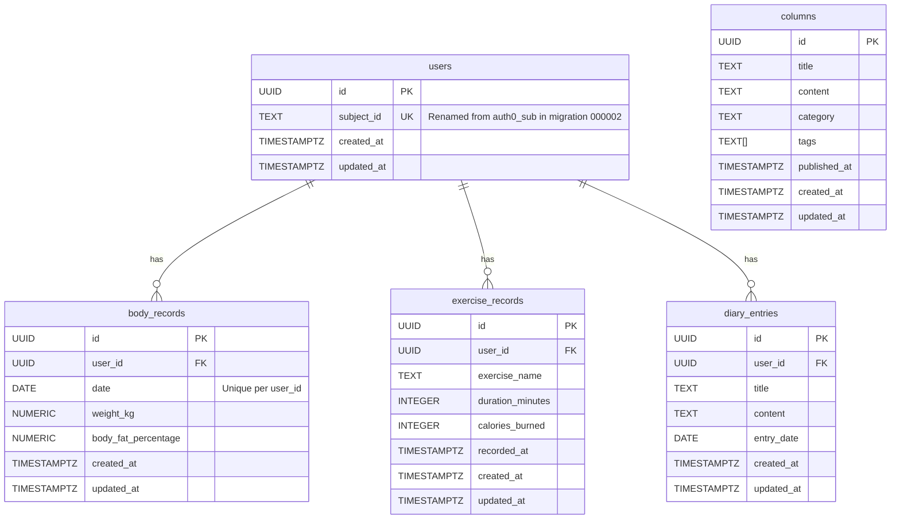

# Health Management API

A backend system for a health management application following Domain-Driven Design (DDD) principles, built with Go, PostgreSQL, and Connect-RPC.

## Features

- User authentication via JWT
- Body composition tracking (weight, body fat percentage)
- Exercise records management
- Personal diary entries
- Health-related articles/columns

## Tech Stack

- **Language**: Go 1.21+
- **Database**: PostgreSQL 15
- **API**: Connect-RPC (gRPC-compatible HTTP API)
- **Authentication**: JWT
- **Code Generation**:
  - sqlc for type-safe SQL
  - buf for Protocol Buffers and Connect-RPC
- **CI/CD**: GitHub Actions with release-please

## Project Structure

The project follows a clean architecture approach with DDD principles:

```terminal
.
├── api/proto/                # Protocol Buffer definitions
├── bin/                      # Compiled binaries
├── cmd/                      # Application entry points (serve, seed)
├── configs/                  # Configuration files
├── db/
│   ├── migrations/           # SQL migrations
│   └── queries/              # SQL queries for sqlc
├── internal/
│   ├── application/          # Application services
│   ├── domain/               # Domain models and repository interfaces
│   ├── infrastructure/       # Implementation details
│   │   ├── auth/             # JWT authentication
│   │   ├── config/           # Configuration loading
│   │   ├── log/              # Logging setup
│   │   ├── persistence/      # Repository implementations
│   │   └── rpc/              # Connect-RPC handlers and generated code
│   └── testutil/             # Testing utilities
└── scripts/                  # Utility scripts (token generation, API tests)
```

## Database Schema

The following diagram shows the main tables and their relationships:



## Getting Started

### Prerequisites

- Go 1.21+
- Docker and Docker Compose
- Make

### Setup

1. Clone the repository:

   ```bash
   git clone https://github.com/atreya2011/health-management-api.git
   cd health-management-api
   ```

2. Install required tools:

   ```bash
   make setup-tools
   ```

3. Start the PostgreSQL database:

   ```bash
   make db-start
   ```

4. Run database migrations:

   ```bash
   make migrate-up
   ```

5. Generate code:

   ```bash
   make generate-all
   ```

6. Configure JWT:
   - Update `configs/config.yaml` with your JWT secret key

7. Build and run the server:

   ```bash
   make build
   ./bin/healthapp_server serve
   ```

   Or use the make command:

   ```bash
   make run
   ```

## Development

### CLI Commands

The application provides a command-line interface with the following commands:

- `serve`: Start the API server

  ```bash
  ./bin/healthapp_server serve [flags]
  ```

  Flags:
  - `-p, --port string`: Port to run the server on (overrides config)
  - `-v, --verbose`: Enable verbose output
  - `--config-path string`: Path to config directory (default "./configs")

- `seed`: Seed the database with mock data

  ```bash
  ./bin/healthapp_server seed [flags]
  ```

  Flags:
  - `-d, --days int`: Number of days to generate mock data for (default 30)
  - `-v, --verbose`: Enable verbose output
  - `--config-path string`: Path to config directory (default "./configs")

### Common Make Commands

- `make help`: Display available commands
- `make build`: Build the server binary
- `make run`: Build and run the server
- `make seed`: Seed the database with mock data
- `make test`: Run tests with real database
- `make proto`: Generate Connect-RPC code from proto files
- `make sqlc`: Generate Go code from SQL queries
- `make migrate-up`: Apply database migrations
- `make migrate-down`: Revert the last database migration
- `make setup-tools`: Install required development tools
- `make generate-all`: Generate all code (protobuf, connect, sqlc)
- `make init-db`: Initialize database (start container & run migrations)
- `make clean`: Clean generated files and build artifacts

### Utility Scripts

The project includes utility scripts in the `scripts/` directory:

- **generate_token.go**: Generate JWT tokens for testing or development

  ```bash
  go run scripts/generate_token.go
  ```

- **test_body_record_api.sh**: Test the Body Record API using curl

  ```bash
  ./scripts/test_body_record_api.sh
  ./scripts/test_column_api.sh
  ./scripts/test_diary_api.sh
  ./scripts/test_exercise_record_api.sh
  ```

  These scripts demonstrate how to interact with the different API endpoints using curl, including creating, listing, and retrieving records. Examine the scripts for specific examples.

### Adding New Features

1. Define the domain model in `internal/domain/`
2. Create repository interface in `internal/domain/`
3. Implement SQL queries in `db/queries/`
4. Implement repository in `internal/infrastructure/persistence/postgres/`
5. Create application service in `internal/application/`
6. Define API in Protocol Buffers (`api/proto/`)
7. Implement Connect-RPC handler in `internal/infrastructure/rpc/handlers/`
8. Register the handler in `cmd/serve.go`

## TODO

### Features & Enhancements
- [ ] **Master Data:**
  - [ ] Implement a master list of exercises (name, description, muscle group, etc.).
  - [ ] Implement a master list of tags (e.g., for diary entries, exercises).
  - [ ] Allow associating exercises with tags.
- [ ] **API Improvements:**
  - [ ] Add pagination to all list endpoints (body records, exercises, diary, columns).
  - [ ] Add filtering and sorting capabilities to list endpoints.
  - [ ] Implement rate limiting for API endpoints.
  - [ ] Standardize error responses across the API.
- [ ] **Data Management:**
  - [ ] Implement soft deletes for user-generated records (body, exercise, diary).
- [ ] **User Features:**
  - [ ] Implement user profile management (name, goals, etc.).
  - [ ] Add goal-setting features (e.g., weight loss target).

### Testing & Quality
- [ ] **Test Suite:**
  - [ ] Improve testing speed (parallel execution, optimize setup/teardown).
  - [ ] Increase test coverage, especially for application services and edge cases.
- [ ] **Code Quality:**
  - [ ] Set up linters (e.g., `golangci-lint`) and enforce style guides.
  - [ ] Add static analysis tools.

### Operations & Infrastructure
- [ ] **Observability:**
  - [ ] Add request tracing across services.
  - [ ] Implement metrics collection (e.g., Prometheus) for monitoring API performance and resource usage.
  - [ ] Set up alerting based on metrics or logs.
- [ ] **Deployment:**
  - [ ] Create Helm charts or Kubernetes manifests for deployment.
  - [ ] Refine CI/CD pipeline (e.g., add deployment stages).
- [ ] **Database:**
  - [ ] Analyze query performance and add necessary database indexes.
  - [ ] Implement a strategy for database backups and restores.

### Documentation
- [ ] **API Docs:**
  - [ ] Generate API documentation (e.g., Swagger/OpenAPI) from Protobuf definitions.
  - [ ] Add examples to API documentation.
- [ ] **Project Docs:**
  - [ ] Expand README sections (e.g., detailed architecture explanation, deployment guide).
  - [ ] Document configuration options more thoroughly.

### Security
- [ ] **Input Validation:**
  - [ ] Add robust input validation at API handlers/service layer.
- [ ] **Dependencies:**
  - [ ] Implement dependency scanning (e.g., `govulncheck`, Snyk).
- [ ] **Secrets Management:**
  - [ ] Improve handling of secrets (avoid hardcoding, use vault/secrets manager).

## Testing

The project uses tests that run against a real PostgreSQL database running in a Docker container. These tests provide realistic testing of database interactions and are particularly useful for testing repositories, services, and handlers.

```bash
make test
```

### Test Utilities

The `internal/testutil` package provides utilities for testing with a real database:

- Spinning up a PostgreSQL Docker container
- Running migrations to set up the schema
- Creating test data (users, body records, etc.)
- Cleaning up after tests

Example usage:

```go
// Set up the test database
testDB := testutil.SetupTestDatabase(t)
defer testDB.TeardownTestDatabase(t)

// Create a test user
ctx := context.Background()
userID, err := testutil.CreateTestUser(ctx, testDB.DB)
if err != nil {
    t.Fatalf("Failed to create test user: %v", err)
}

// Use test helpers to create data and repositories
// Example: Create a Body Record repository
bodyRecordRepo := testutil.NewBodyRecordRepository(testDB.Pool) 
// ... use repo ...

// Example: Create a test Diary Entry
diaryEntry := testutil.CreateTestDiaryEntry(ctx, t, testDB.Pool, userID)
// ... use diaryEntry ...
```

See `internal/testutil/README.md` and the specific helper files (e.g., `body_record_helpers.go`) for more details on the available test utilities.
